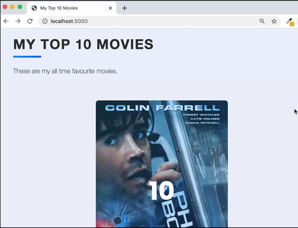
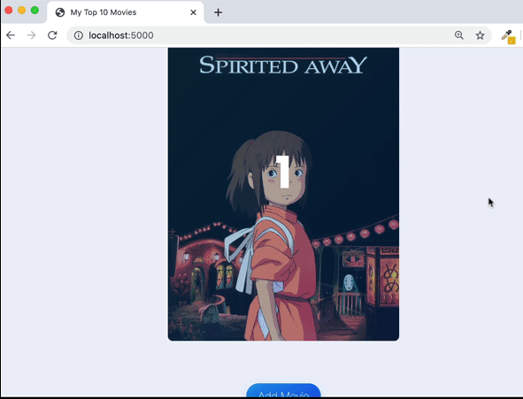

## Movie List Web Development
#### This is a project of movie list to store your movie collections. Deleopment using API database, WTF form, SQLite, and Flask web server.

#### The project running on : https://replit.com/@ViktoriusSuwand/AppBrewery-python-Day-64-Movie-Flask-Website

### Technology and Features :
    * API to get data from movies database
    * flask-Bootstrap as Front-End CSS Framework
    * Jinja 2 for data transfer with Front-End and Back-End
    * flask-WTF for dynamic and user's form validation

### Development
1. Create an SQLite database with SQLAlchemy. The database needs to contain a "Movie" Table. This table should contain the following fields: `id`, `title`, `year`, `description`, `rating`, `ranking`, `review`, `img_url`.
2. Insert an example movie data :
   ```ruby
    new_movie     = Movie(
      title       = "Phone Booth",
      year        = 2002,
      description = "Publicist Stuart Shepard finds himself trapped in a phone booth, pinned down by an extortionist's sniper rifle. Unable to leave or receive outside help, Stuart's negotiation with the caller leads to a jaw-dropping climax.",
      rating      = 7.3,
      ranking     = 10,
      review      = "My favourite character was the caller.",
      img_url     = "https://image.tmdb.org/t/p/w500/tjrX2oWRCM3Tvarz38zlZM7Uc10.jpg")

3. On the `home` page, create html `card` elements to visualize the `movie data`.


4. There is an `edit` button on the back of the movie card, create WTF form to change movie attributes, such as `rating` and `review`.


5. On the back of each `movie card`, there is also a `Delete` button. Make this button work and allow the movie entry to be deleted from the database.


6. Make the `add page` render when user click on the `Add` Movie button on the `Home page`. The Add page should show a WTF quick form that only contains 1 field - the title of the movie.


7. Using the data get from the `API`, the `select.html` page should render all the movie `title` and `year` of release on to the `page`. Then choose `the movie` want to add.


8. If user add another `movie` and it had the `highest rating` among the movies, then it should be `ranked according` to it's rating.
